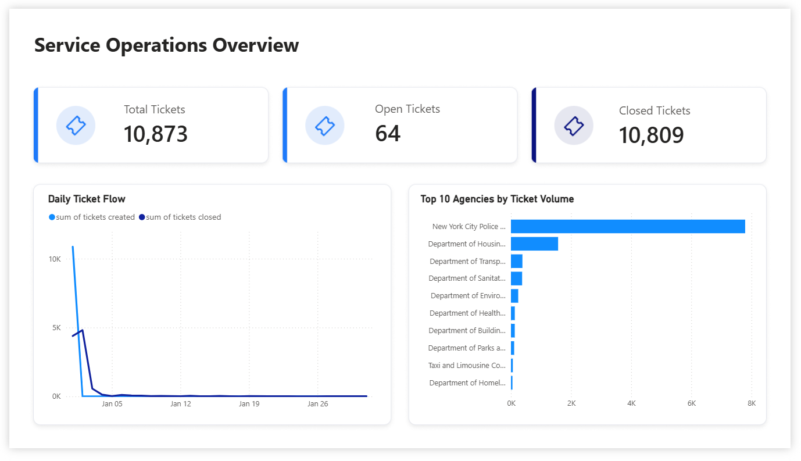
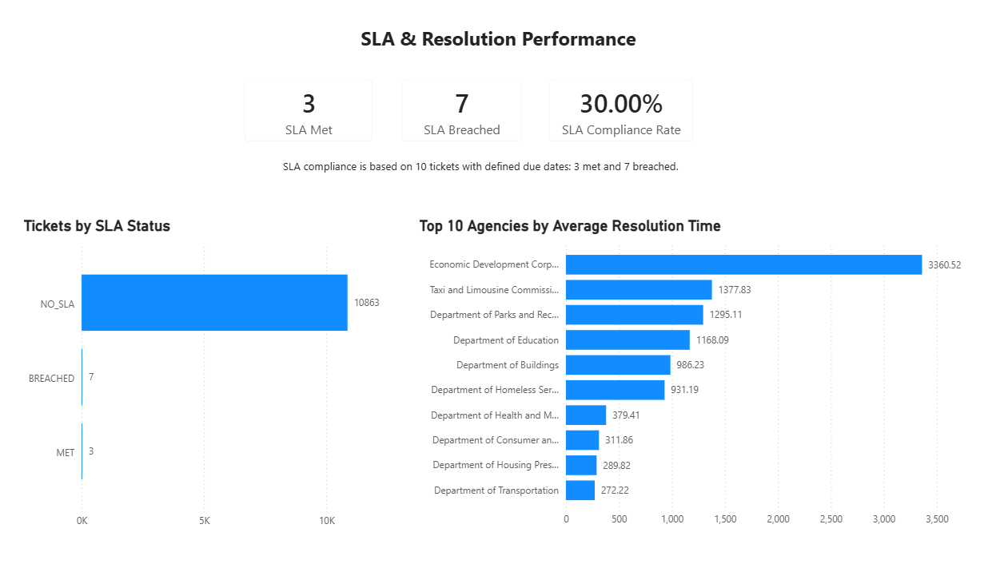
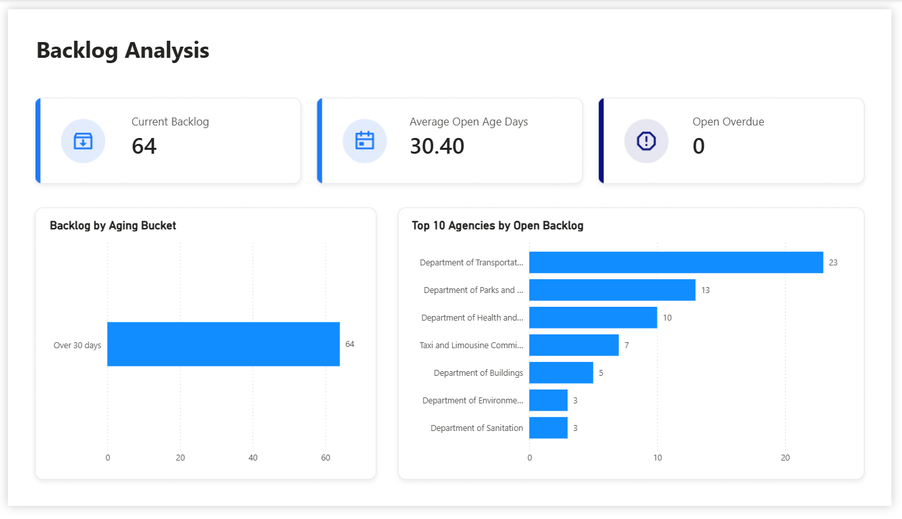

# Service Operations SLA & Ticket Analytics Pipeline

An end-to-end data pipeline that extracts [NYC 311 service requests](https://data.cityofnewyork.us/Social-Services/311-Service-Requests-from-2020-to-Present/erm2-nwe9/about_data), transforms them into operational ticket metrics, loads the results into PostgreSQL, and provides reporting views for a Power BI dashboard.

## Project Overview

Service teams need a reliable way to monitor ticket demand, resolution performance, unresolved backlog, and SLA compliance.

This project treats NYC 311 service requests as support tickets and analyzes:

- Ticket creation and closure activity
- Current open backlog
- Resolution time by agency
- SLA compliance and breaches
- Open-ticket aging
- Agency-level operational performance

## Architecture

```text
NYC 311 API
    → Python extraction
    → Raw JSONL snapshot
    → PostgreSQL raw table
    → Pandas transformation and quality checks
    → PostgreSQL analytics table
    → SQL reporting views
    → Power BI dashboard
```

## Tech Stack

- Python
- Requests
- Pandas
- PostgreSQL
- SQL
- SQLAlchemy
- psycopg
- Pytest
- Power BI
- Git and GitHub

## Data Pipeline

The pipeline:

1. Extracts service requests from the NYC Open Data API.
2. Saves a raw JSONL snapshot for traceability.
3. Validates and transforms ticket records with Pandas.
4. Normalizes ticket statuses and calculates lifecycle metrics.
5. Loads raw and cleaned records into PostgreSQL.
6. Updates an audit table with pipeline-run results.
7. Provides SQL reporting views for Power BI.

## Database Layers

| Schema | Purpose |
|---|---|
| `raw` | Stores records as received from the API |
| `analytics` | Stores cleaned and transformed ticket data |
| `reporting` | Provides views used by Power BI |
| `audit` | Records pipeline execution details |

### Reporting Views

- `reporting.vw_daily_ticket_flow`
- `reporting.vw_agency_performance`
- `reporting.vw_sla_performance`
- `reporting.vw_current_backlog`

## Data Quality Checks

The transformation process checks for:

- Missing ticket IDs
- Invalid timestamps
- Duplicate ticket IDs
- Closed dates earlier than created dates
- Due dates earlier than created dates
- Missing due dates
- Unknown ticket statuses

## Power BI Dashboard

The dashboard contains three pages:

### Operations Overview

- Total, open, and closed ticket cards
- Daily ticket flow
- Top agencies by ticket volume



### SLA & Resolution Performance

- SLA met and breached tickets
- SLA compliance rate
- SLA-status distribution
- Agencies with the highest average resolution time



### Backlog Analysis

- Current open backlog
- Average open-ticket age
- Open overdue tickets
- Backlog aging distribution
- Agencies with the largest open backlog




## Data Source

NYC Open Data — **311 Service Requests from 2020 to Present**

Dataset ID: `erm2-nwe9`

## Author

**Sofia Mercado**  

[LinkedIn](https://www.linkedin.com/in/sofialyn/) | [GitHub](https://github.com/mercado-sofia) | [sofia1809.mercado@gmail.com](mailto:sofia1809.mercado@gmail.com)