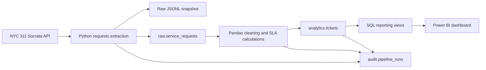

# Solution Architecture
 

 
## Data flow
 
1. `src/extract.py` requests a selected date range from the NYC 311 API using pagination.
2. The untouched records are saved locally as JSONL and appended to `raw.service_requests`.
3. `src/transform.py` standardizes timestamps and statuses, removes unusable rows, and calculates resolution, aging, and SLA fields.
4. `src/load.py` upserts the cleaned ticket records into `analytics.tickets`.
5. PostgreSQL reporting views provide simple, stable sources for Power BI.
6. `audit.pipeline_runs` stores the outcome and quality summary for each execution.